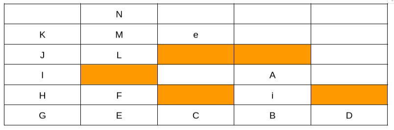
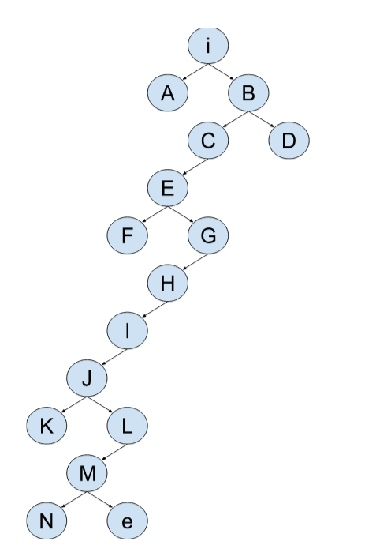

### PROFUNDIDAD

C \= {} 					                      F \= {i}  
C \= {i} 					                      F \= {A, B}  
C \= {i, B} 				                    F \= {A, C, D}  
C \= {i, B, D} 				                  F \= {A, C}  
C \= {i, B, D, C} 			                F \= {A, E}  
C \= {i, B, D, C, E}   			            F \= {A, F, G}  
C \= {i, B, D, C, E, G}  			          F \= {A, F, H}   
C \= {i, B, D, C, E, G, H}		          F \= {A, F, I}  
C \= {i, B, D, C, E, G, H, I}		        F \= {A, F, J}  
C \= {i, B, D, C, E, G, H, I, J}		    F \= {A, F, K, L}  
C \= {i, B, D, C, E, G, H, I, J, L}	    F \= {A, F, K, M}	  
C \= {i, B, D, C, E, G, H, I, J, L, M}	F \= {A, F, K, N, e}

Dado que me desplazo por las casillas según que letra sea posterior en el abecedario, el algoritmo que utilizo es un algoritmo LIFO (Last In, First Out).

#### Solución:
#### i => B => D => C => E => G => H => I => J => L => M => e               

### PROFUNDIDAD CON LÍMITE

C \= {}                             F \= {i}  
C \= {i} 					                  F \= {A, B}  
C \= {i, B} 				                F \= {A, C, D}  
C \= {i, B, D} 				              F \= {A, C}  
C \= {i, B, D, C} 			            F \= {A, E}  
C \= {i, B, D, C, E}   			        F \= {A, F, G}  
C \= {i, B, D, C, E, G}  			      F \= {A, F, H}   
C \= {i, B, D, C, E, G, A}  		    F \= {F, H, I, J}   
C \= {i, B, D, C, E, G, A, J}  		  F \= {F, H, I, K}   
C \= {i, B, D, C, E, G, A, J, K} 		F \= {F, H, I, L}  
C \= {i, B, D, C, E, G, A, J, K, L} F \= {F, H, I, M, N}

Primero voy por B, pero alcanzo el límite 5 cuando llego a G, asi que continuo por A, pero al llegar a N alcanzo otra vez el límite.  
Tipo de fracaso: Valor de corte.  
Si el límite fuera 6, entonces llegaría hasta el objetivo e.

C \= {} 						                          F \= {i}  
C \= {i} 						                          F \= {A, B}  
C \= {i, B} 					                        F \= {A, C, D}  
C \= {i, B, D} 					                      F \= {A, C}  
C \= {i, B, D, C} 				                    F \= {A, E}  
C \= {i, B, D, C, E}   				                F \= {A, F, G}  
C \= {i, B, D, C, E, G}  				              F \= {A, F, H}   
C \= {i, B, D, C, E, G, H}  			            F \= {A, F, I}  
C \= {i, B, D, C, E, G, H, A}  			          F \= {F, I, J, K}   
C \= {i, B, D, C, E, G, H, A, K}  		        F \= {F, I, J, L}  
C \= {i, B, D, C, E, G, H, A, K, L}  		      F \= {F, I, J, M}  
C \= {i, B, D, C, E, G, H, A, K, L, M}  		  F \= {F, I, J, N, Ñ}  
C \= {i, B, D, C, E, G, H, A, K, L, M, Ñ} 	  F \= {F, I, J, N, O, e}  
C \= {i, B, D, C, E, G, H, A, K, L, M, Ñ, e}

#### Solución:
#### i => A => K => L => M => Ñ => e
