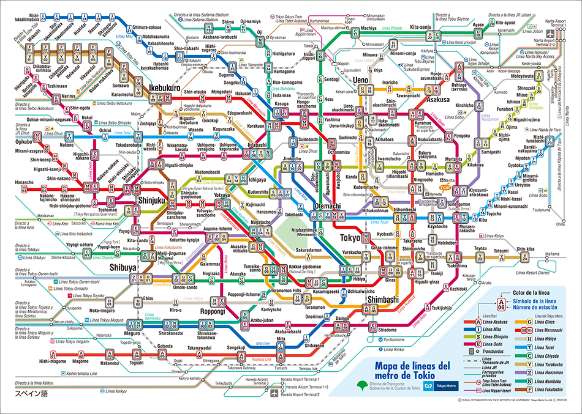

### PROFUNDIDAD

C \= {}                                 F \= {i}  
C \= {i}                                F \= {A, B}  
C \= {i, B}                             F \= {A, C, D}  
C \= {i, B, D}                          F \= {A, C}  
C \= {i, B, D, C}                       F \= {A, E}  
C \= {i, B, D, C, E}                    F \= {A, F, G}  
C \= {i, B, D, C, E, G}                 F \= {A, F, H}   
C \= {i, B, D, C, E, G, H}              F \= {A, F, I}  
C \= {i, B, D, C, E, G, H, I}           F \= {A, F, J}  
C \= {i, B, D, C, E, G, H, I, J}        F \= {A, F, K, L}  
C \= {i, B, D, C, E, G, H, I, J, L}     F \= {A, F, K, M}	  
C \= {i, B, D, C, E, G, H, I, J, L, M}  F \= {A, F, K, N, e}

Dado que me desplazo por las casillas según que letra sea posterior en el abecedario, el algoritmo que utilizo es un algoritmo LIFO (Last In, First Out).

#### Solución:
#### i => B => D => C => E => G => H => I => J => L => M => e  

### PROFUNDIDAD CON LÍMITE

C \= {}                             F \= {i}  
C \= {i} 					                  F \= {A, B}  
C \= {i, B} 				                F \= {A, C, D}  
C \= {i, B, D} 				              F \= {A, C}  
C \= {i, B, D, C} 			            F \= {A, E}  
C \= {i, B, D, C, E}   			        F \= {A, F, G}  
C \= {i, B, D, C, E, G}  			      F \= {A, F, H}   
C \= {i, B, D, C, E, G, A}  		    F \= {F, H, I, J}   
C \= {i, B, D, C, E, G, A, J}  		  F \= {F, H, I, K}   
C \= {i, B, D, C, E, G, A, J, K} 		F \= {F, H, I, L}  
C \= {i, B, D, C, E, G, A, J, K, L} F \= {F, H, I, M, N}

Primero voy por B, pero alcanzo el límite 5 cuando llego a G, asi que continuo por A, pero al llegar a N alcanzo otra vez el límite.  
Tipo de fracaso: Valor de corte.  
Si el límite fuera 6, entonces llegaría hasta el objetivo e.

C \= {} 						                          F \= {i}  
C \= {i} 						                          F \= {A, B}  
C \= {i, B} 					                        F \= {A, C, D}  
C \= {i, B, D} 					                      F \= {A, C}  
C \= {i, B, D, C} 				                    F \= {A, E}  
C \= {i, B, D, C, E}   				                F \= {A, F, G}  
C \= {i, B, D, C, E, G}  				              F \= {A, F, H}   
C \= {i, B, D, C, E, G, H}  			            F \= {A, F, I}  
C \= {i, B, D, C, E, G, H, A}  			          F \= {F, I, J, K}   
C \= {i, B, D, C, E, G, H, A, K}  		        F \= {F, I, J, L}  
C \= {i, B, D, C, E, G, H, A, K, L}  		      F \= {F, I, J, M}  
C \= {i, B, D, C, E, G, H, A, K, L, M}  		  F \= {F, I, J, N, Ñ}  
C \= {i, B, D, C, E, G, H, A, K, L, M, Ñ} 	  F \= {F, I, J, N, O, e}  
C \= {i, B, D, C, E, G, H, A, K, L, M, Ñ, e}

#### Solución:
#### i => A => K => L => M => Ñ => e

### ANCHURA  

C \= {} 							                                 F \= {i}  
C \= {i} 							                                 F \= {A, B}  
C \= {A, B} 						                               F \= {C, D, E, F}  
C \= {A, B, C, D, E, F} 					                     F \= {G, H}  
C \= {A, B, C, D, E, F, G, H} 				                 F \= {I, J, K}  
C \= {A, B, C, D, E, F, G, H, I, J, K} 			           F \= {L, M, N}  
C \= {A, B, C, D, E, F, G, H, I, J, K, L, M, N}        F \= {Ñ, e, O}  
C \= {A, B, C, D, E, F, G, H, I, J, K, L, M, N, Ñ, e} 	

#### Solución:  
#### i => A => D => G => I => M => e  

### BÚSQUEDA POR COSTE UNIFORME

| Trayecto            | Distancia en km      |
| :------------------ | :------------------:|
| Ourense, Ponferrada | 175                 |
| Ourense, Benavente  | 236                 |
| Ponferrada, León    | 113                 |
| Ponferrada, Benavente | 125               |
| Benavente, León     | 75                  |
| Benavente, Valladolid | 112               |
| Benavente, Palencia | 112                 |
| Palencia, León      | 131                 |
| Palencia, Valladolid | 48                 |
| Palencia, Osorno    | 49                  |
| Palencia, Burgos    | 92                  |
| León, Osorno        | 121                 |
| Osorno, Burgos      | 59                  |
| Valladolid, Aranda  | 95                  |
| Burgos, Aranda      | 84                  |
| Aranda, Osma        | 58                  |
| Osma, Calatayud     | 140                 |
| Osma, Soria         | 58                  |
| Burgos, Soria       | 143                 |
| Burgos, Logroño     | 150                 |
| Logroño, Soria      | 106                 |
| Soria, Calatayud    | 91                  |

E = {0}  
F = {Ourense[0km]}

E = {Ourense[0km]}  
F = {Ponferrada[175km] (Ourense), Benavente[236km] (Ourense)}

E = {Ourense[0km], Ponferrada[175km] (Ourense)}  
F = {Benavente[236km] (Ourense), León[288km] (Ponferrada), Benavente[300km] (Ponferrada)}

E = {Ourense[0km], Ponferrada[175km] (Ourense),Benavente[236km] (Ourense)}  
F = {León[288km] (Ponferrada), León[311km] (Benavente), Valladolid[348km] (Benavente), Palencia[348km] (Benavente)}

E = {Ourense[0km], Ponferrada[175km] (Ourense),Benavente[236km] (Ourense), León[288km] (Ponferrada)}  
F = {Valladolid[348km] (Benavente), Palencia[348km] (Benavente), Osorno[401km] (León)}

E = {Ourense[0km], Ponferrada[175km] (Ourense),Benavente[236km] (Ourense), León[288km] (Ponferrada), Valladolid[348km] (Benavente)}  
F = {Palencia[348km] (Benavente), Osorno[401km] (León), Aranda[443km] (Valladolid)}

E = {Ourense[0km], Ponferrada[175km] (Ourense),Benavente[236km] (Ourense), León[288km] (Ponferrada), Valladolid[348km] (Benavente), Palencia[348km] (Benavente)}  
F = {Osorno[401km] (León), Aranda[443km] (Valladolid), Osorno[397km] (Palencia), Burgos[440km] (Palencia)}

E = {Ourense[0km], Ponferrada[175km] (Ourense),Benavente[236km] (Ourense), León[288km] (Ponferrada), Valladolid[348km] (Benavente), Palencia[348km] (Benavente), Osorno[397km] (Palencia)}  
F = {Aranda[443km] (Valladolid), Burgos[440km] (Palencia), Burgos[456km] (Osorno)}

E = {Ourense[0km], Ponferrada[175km] (Ourense),Benavente[236km] (Ourense), León[288km] (Ponferrada), Valladolid[348km] (Benavente), Palencia[348km] (Benavente), Osorno[397km] (Palencia), Burgos[440km] (Palencia)}  
F = {Aranda[443km] (Valladolid), Aranda[524km] (Burgos), Soria[583km] (Burgos), Logroño[590km] (Burgos)}

E = {Ourense[0km], Ponferrada[175km] (Ourense),Benavente[236km] (Ourense), León[288km] (Ponferrada), Valladolid[348km] (Benavente), Palencia[348km] (Benavente), Osorno[397km] (Palencia), Burgos[440km] (Palencia), Aranda[443km] (Valladolid)}  
F = {Soria[583km] (Burgos), Logroño[590km] (Burgos), Osma[501km] (Aranda)}

E = {Ourense[0km], Ponferrada[175km] (Ourense),Benavente[236km] (Ourense), León[288km] (Ponferrada), Valladolid[348km] (Benavente), Palencia[348km] (Benavente), Osorno[397km] (Palencia), Burgos[440km] (Palencia), Aranda[443km] (Valladolid), Osma[501km] (Aranda)}  
F = {Soria[583km] (Burgos), Logroño[590km] (Burgos), Calatayud[641km] (Osma), Soria[559km] (Osma)}

E = {Ourense[0km], Ponferrada[175km] (Ourense),Benavente[236km] (Ourense), León[288km] (Ponferrada), Valladolid[348km] (Benavente), Palencia[348km] (Benavente), Osorno[397km] (Palencia), Burgos[440km] (Palencia), Aranda[443km] (Valladolid), Osma[501km] (Aranda), Soria[559km] (Osma)}  
F = {Logroño[590km] (Burgos), Calatayud[641km] (Osma), Calatayud[650km] (Soria)}

E = {Ourense[0km], Ponferrada[175km] (Ourense),Benavente[236km] (Ourense), León[288km] (Ponferrada), Valladolid[348km] (Benavente), Palencia[348km] (Benavente), Osorno[397km] (Palencia), Burgos[440km] (Palencia), Aranda[443km] (Valladolid), Osma[501km] (Aranda), Soria[559km] (Osma), Logroño[590km] (Burgos)}  
F = {Calatayud[641km] (Osma), Calatayud[650km] (Soria)}

E = {Ourense[0km], Ponferrada[175km] (Ourense),Benavente[236km] (Ourense), León[288km] (Ponferrada), Valladolid[348km] (Benavente), Palencia[348km] (Benavente), Osorno[397km ] (Palencia), Burgos[440km] (Palencia), Aranda[443km] (Valladolid), Osma[501km] (Aranda), Soria[559km] (Osma), Logroño[590km] (Burgos), Calatayud[641km] (Osma)}

#### Solución:
#### Ourense => Benavente => Valladolid => Aranda => Osma => Calatayud

### A / A*

#### Solución: 
#### i => A => D => G => I => K => e

#### Ejercicio 2:
La heurística utilizada en el algoritmo A es admisible, ya que el valor de la heurística para todos los estados es inferior al coste mínimo real para alcanzar e desde i. Por tanto, podemos decir que el algoritmo es A*. 

### TOKYO TUB: TATSUMI -> OTEMACHI

#### Solución:
 #### Y23 => Y22 => Y21 => Y20 => Y19 => Y18 => M17 => M18

